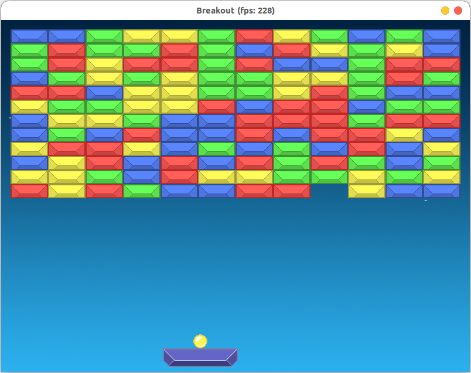

## Project Description

A simple Old Arcade Paddle and Ball game (Breakout I guess) in sdl, reutilized existed object models as well as alogorithms for ball moving and object collision.

I tried sticking to a game, renderer, controller model but it was simpler for me in the end to just relegate the graphic of each object, to its own file with game.cpp acting as a controller also.

## Rubric Points Specified
some examples of my code following the rubric:

- Loops, Functions, I/O

The project demonstrates an understanding of C++ functions and control structures. 
file game.cpp - use of multiple switch case, and nested condition to process mouse control and object interaction.

The project accepts user input and processes the input.
using the sdl library, sdl image, sdl ttf

- Object Oriented Programming

The project uses Object Oriented Programming techniques.
Can be seen in each file except main.cpp

Classes use appropriate access specifiers for class members. 
Classes encapsulate behavior.
Classes abstract implementation details from their interfaces.
can be seen in BaseObject.h

- Memory Management

The project uses destructors appropriately.
Can be seen in each file except main.cpp. After creating object pointer of a class, the delete called right after that.

## Dependencies for running locally
* make >= 4.1 (linux, mac) 3.81 (Windows)
	* Linux: already installed bu default in most distros 
* g++ >= 4.0
	* Linux: `sudo apt install build-essential` 
              usually it is already installed by default in most distros
* SDL2 library to compile the project 
	* Linux: `sudo apt-get install libsdl2-dev`
* SDL2 image to support image processing
	* Linux: `sudo apt install libsdl2-image-dev`
* SDL2 TTF to support display text as well as font loading
    * Linux: `sudo apt-get install libsdl2-ttf-dev`

## Build instructions
1. Clone this repo
2. inside the folder containing the readme file, run `make` to compile 
3. Run the target compiled file: `./Breakout`.

## Notes
*This project is running on Ubuntu 22.04, It is likely that running on other platforms or distros could cause unpredictable error